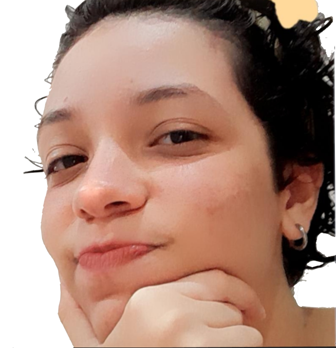

## Hello World! 👋

 My name is Letícia Gabrielle, but my friends call me Gabigol~ I'm a full-stack student in SENAI - AL. I love creating creative design websites and I'm not afraid to learn a thousand things to do it. To learn out of the programming course, I love browsing Pinterest and YouTube, asking for help only when needed

⚡| Currently focusing on <b>Front-End</b> 👌

🔭| Loading new ideas...

🚀| <b>Currently learning: React</b>

 

  <h1>Currently using:</h1>
    
    
    
  
  

